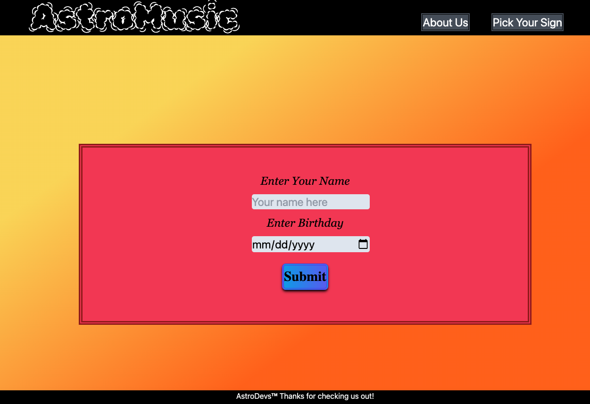

# Astro-Music
Have you been in the mood lately for new music? If you, like myself, are always searching for new music and new playlists to listen to while at work, driving, studying or just hanging out. 

Then we might be able to help you out! 

AstroMusic is a new way to discover new unique playlists based off of your Astrological sign and your daily horoscope. Each day you’ll have a chance to enter your date of birth and not only get back your daily horoscope but you’ll also be given a playlist to match that day's fortune. 

We hope this website can provide our users a unique and fun way to discover new music. Finding new music in today’s digital world can be a little bit of a daunting task, with our app users can quickly and easily find a playlist to fit their day without having to siphon through endless possibilities.

---

## Information
On a daily basis our users will be able to enter their birthday, or select from a list of the different horoscope signs, and they will be given their daily fortune, their lucky time for that day, their lucky number for that day and most importantly a playlist tailored to that day’s mood. 

We all think that it’s become harder and harder these days to discover new music. We hope that users who want to discover new music on a daily basis would be able to get a new playlist each day, and hopefully help them discover new interesting music that might be outside of the normal scope of genres they typically enjoy. 

---

## Screenshot of finished page 

---

## Link to github pages and repo

Published Page - https://astro-div.github.io/Astro-Music/

REPO - https://github.com/Astro-Div/Astro-Music